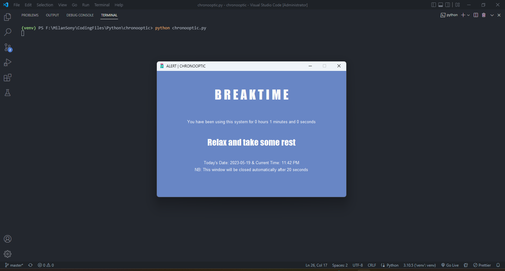

<p align="center">
    
</p>

# chronooptic

Do you also spend too much time infront of screen? Spending long periods looking at a screen can strain the eyes. Chronooptic is a simple program that gives alert based on <a href = "https://www.healthline.com/health/eye-health/20-20-20-rule">20-20-20 rule</a>. It works in such a way that for every 20 minutes it will gives you an alert. The are many other applications out there but I taught to buld one for myself.

## Libraries used

- `tkinter`
- `pyttsx3`
- `playsound`

## Read documentation about

- <a href = "https://docs.python.org/3/library/tkinter.html">Tkinter</a>
- <a href = "https://www.healthline.com/health/eye-health/20-20-20-rule">20-20-20 rule</a>

## Run locally

You will need to install Python on you system, head over to https://www.python.org/downloads/ to download python.
(Dont Forget to tick `Add Python to PATH` while installing Python)

Once you have downloaded Python on your system, 
run the following command inside your terminal (only if your system is git enabled, otherwise download the zip file and extract it)

```bash
  git clone https://github.com/milan-sony/chronooptic.git
```

Then go to the project folder

```bash
  cd chronooptic
```

(This is optional, but strongly recommended) Make a virtual environment

```bash
  python -m venv venv
```

Activate the virtual environment

```bash
  venv/Scripts/activate
```

If error occurs when activating virtual environment, run the following command

```bash
  Set-ExecutionPolicy -Scope CurrentUser -ExecutionPolicy Unrestricted
```

Then Install the dependencies needed for this project

```bash
  pip install -r requirements.txt
```

Now run the script

```bash
  python chronooptic.py
```

or

```bash
  python chronooptic2.py
```

## Screenshot


